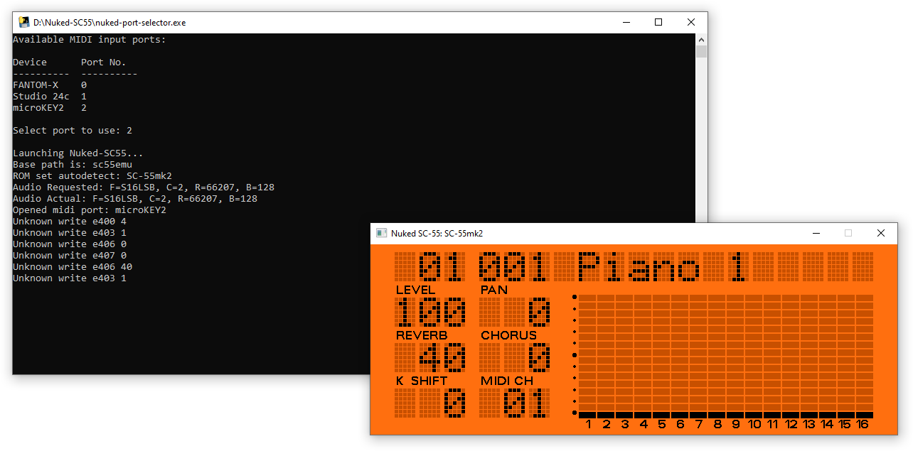
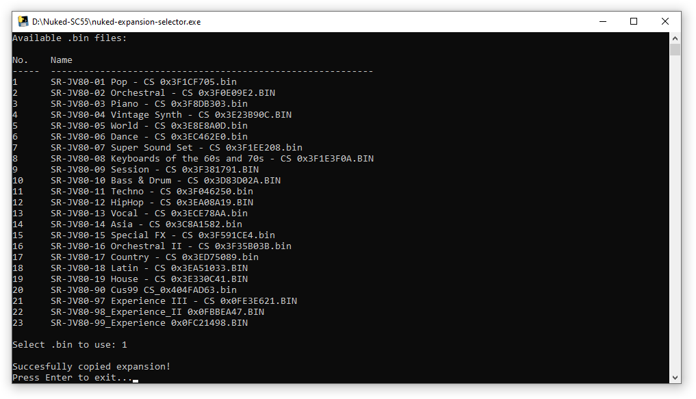

# Tools for Nuked-SC55
These are just some basic Python tools I wrote (with my limited Python knowledge) to make [Nuked-SC55](https://github.com/nukeykt/Nuked-SC55) easier to use. Bundled Windows EXEs can be found on the [Releases page](https://github.com/ColouMods/Tools-for-Nuked-SC55/releases) for those who don't want to install Python and/or the required modules.

Currently there are 2 tools:
- **nuked-port-selector**
- **nuked-expansion-selector**

## Nuked Port Selector
This program displays all of the MIDI input ports available on your PC, and then launches Nuked-SC55 with the port that you select.



### Prerequisites
The program requires [Mido](https://pypi.org/project/mido/)'s RtMidi backend to be installed for fetching the MIDI input ports.
```
pip install mido[ports-rtmidi]
```

It also requires [Tabulate](https://pypi.org/project/tabulate/) to be installed for drawing the table in the command line.
```
pip install tabulate
```

### Usage
Simply place the program in the same folder as Nuked-SC55 and launch it using Python (or, if you're using the [bundled EXE version](https://github.com/ColouMods/Tools-for-Nuked-SC55/releases), just run the executable).
```
python nuked-port-selector.py
```

Any command line arguments you give to the program will be passed to Nuked-SC55. For example, if you wanted to launch Nuked-SC55 in JV-880 mode, you would run this:
```
python nuked-port-selector.py -jv880
```

### Configuration
The program can be configured further by creating an INI file named `nuked-port-selector.ini` in the same folder as the program.

```ini
[settings]
executable_path = path/filename.exe
arguments = -argument
```

- `executable_path` - Sets the path (fixed or relative) to the executable. Defaults to 'sc55emu'.
- `arguments` - Sets command line arguments that will always be passed with the program. Defaults to nothing.

## Nuked Expansion Selector

This program allows you to quickly replace `jv880_waverom_expansion.bin` with another .bin file of your choosing, making switching between SR-JV80 expansion boards more convenient. 

The program looks for a folder named 'expansions' in the Nuked-SC55 folder and displays all .bin files within that folder. Then, once you select a .bin file, it moves that .bin file to your Nuked-SC55 folder and renames it to 'jv880_waverom_expansion.bin'.



### Prerequisites
The program requires [Tabulate](https://pypi.org/project/tabulate/) to be installed for drawing the table in the command line.
```
pip install tabulate
```

### Usage
Simply place the program in the same folder as Nuked-SC55 and launch it using Python (or, if you're using the [bundled EXE version](https://github.com/ColouMods/Tools-for-Nuked-SC55/releases), just run the executable).
```
python nuked-expansion-selector.py
```

### Configuration
The program can be configured further by creating an INI file named `nuked-expansion-selector.ini` in the same folder as the program.

```ini
[settings]
expansions_folder = path\to\folder
bin_filename = filename.bin
```

- `expansions_folder` - Sets the path (fixed or relative) to the folder containing the .bin files. Defaults to 'expansions'.
- `bin_filename` - Sets the name of the BIN file the program creates. Defaults to 'jv880_waverom_expansion.bin'. You probably won't need to change this unless you've changed the name of the .bin file in Nuked-SC55's code.
